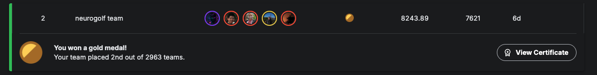
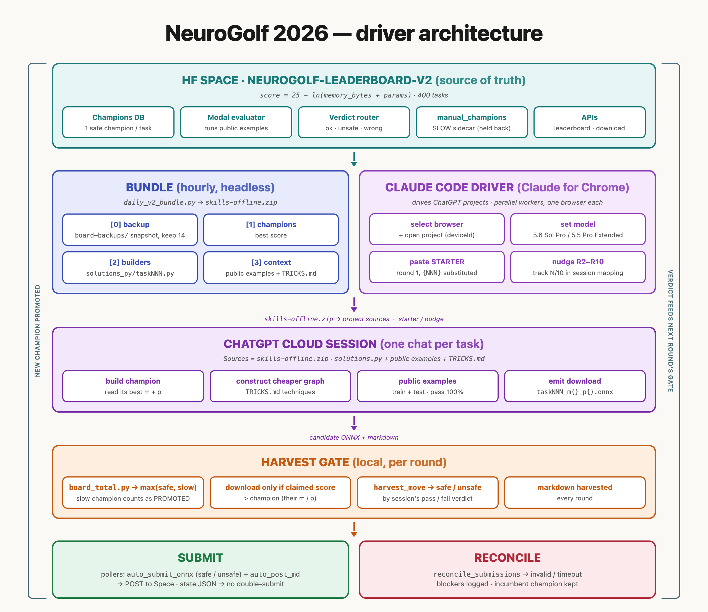

# NeuroGolf 2026 — 2nd place solution

Team solution for [NeuroGolf 2026](https://www.kaggle.com/competitions/neurogolf-2026) —
**2nd of 2963 teams**.



## Team

- https://www.kaggle.com/jacekwl
- https://www.kaggle.com/chankhavu
- https://www.kaggle.com/yeoyunsianggeremie
- https://www.kaggle.com/gufanmingmie
- https://www.kaggle.com/yhirano

This repository contains the browser-driven optimisation pipeline.

## The problem

400 ARC-style tasks. For each one you submit an ONNX graph that solves it, and the score is

```
score = 25 - ln(memory_bytes + params)
```

summed over all 400 tasks. `params` is the total initializer element count and `memory_bytes` is
intermediate-tensor traffic, both from static graph inspection. So the game is to solve each task
with the smallest possible graph — every factor of `e` cut from `memory + params` is worth +1.0.

## How it works



Claude Code acts as a **driver**. It does not solve tasks itself; it runs a round-robin sweep over a
task list, driving long-running ChatGPT sessions through Claude for Chrome:

1. **Bundle** — `daily_v2_bundle.py` downloads the current champion ONNX for all 400 tasks from the
   leaderboard Space, regenerates a Python *builder* per task, and zips `skills-offline/`. That zip is
   uploaded into a ChatGPT project's Sources, giving every session the current baseline to beat.
2. **Drive** — for each task the driver opens a session and pastes a playbook
   (`COMPRESS_EINSUM_STARTER.txt` / `CONVERT_0M_STARTER.txt`), then sends nine follow-up nudges over
   ten sweep rounds. Sessions run 30–90 minutes each.
3. **Harvest** — candidates are emitted as `task{NNN}_m{memory}_p{params}.onnx`, so the filename *is*
   the claimed score. The driver downloads only files claiming to beat the live champion, gated on
   `board_total.py`.
4. **Submit** — pollers watch the artifact folders and submit to the leaderboard Space
   asynchronously; `reconcile_submissions_*.py` then routes each file by the Space's verdict into
   `safe/`, `unsafe/`, `invalid/` or `timeout/`.

Four lanes are included, each a self-contained skill under `.claude/skills/`:

| Lane | Objective |
|---|---|
| `neurogolf-compress-einsum-v1` | champion is already one memory-0 `Einsum` → shrink its params |
| `neurogolf-convert-to-0m-einsum-v1` | champion is *not* memory-0 → re-express as one memory-0 `Einsum` with `params < m+p` |
| `neurogolf-runtime-v1` | same score, lower runtime, by reordering `Einsum` operands only |
| `neurogolf-daily-bundle` | rebuild `skills-offline.zip` from the current champions |

## Correctness gate

A candidate is correct **iff it passes 100% of the examples shipped for that task**:

```bash
python skills-offline/evaluate/scripts/evaluate.py \
  --input task381_candidate.onnx --tasks task381 --new-samples 0
```

which grades against `skills-offline/evaluate/scripts/neurogolf-2026/task381.json`
(train + test + seed-cracked arc-gen) and prints per-split pass/fail plus `memory_bytes` / `params` /
score. Pass them all and the candidate ships — any construction that reaches the highest score is
fair game.

## Setup

Python 3.12. Install the evaluator's pinned dependencies plus the few the pipeline scripts need:

```bash
pip install -r skills-offline/evaluate/requirements.txt
pip install gradio_client huggingface_hub python-dotenv requests
```

Versions this was run with: `onnxruntime 1.24.4`, `onnx 1.21.0`, `numpy 2.4.4`,
`gradio_client 2.5.0`, `huggingface_hub 0.35.3`.

Create `.env` at the repo root (it is gitignored — never commit it):

```
HF_TOKEN=hf_...
```

The token is needed to submit and to rebuild the bundle. Reading the leaderboard works without one.

## Reproduce a champion

Every builder in `skills-offline/solutions_py/` is a standalone script that writes its ONNX:

```bash
# build task381's champion and score it
python skills-offline/solutions_py/task381.py /tmp/task381.onnx
python skills-offline/evaluate/scripts/evaluate.py \
  --input /tmp/task381.onnx --tasks task381 --new-samples 0
```

```
ARC-AGI examples: 4 pass, 0 fail
ARC-GEN examples: 25 pass, 0 fail
Total measured memory bytes: 0
Total measured params: 80
Total ready-task points: 20.617973
```

To check the whole set against the live leaderboard — these two numbers should agree:

```bash
python zzz_sessions/board_total.py          # live board overall_score
python -c "import glob,re;print(round(sum(float(re.search(r\"'score':\s*([0-9.]+)\",open(f).read()).group(1)) for f in glob.glob('skills-offline/solutions_py/task*.py')),4))"
```

## Run a sweep

`GOAL_MESSAGES.txt` holds a ready-to-paste `/goal` message per lane. Open Claude Code in this
directory, paste one, and fill in the two placeholders:

- `<YOUR CHATGPT PROJECT URL>` — a ChatGPT project you own, with `skills-offline.zip` in its Sources
- `<YOUR BROWSER ID>` — the Claude for Chrome browser to drive. Run `list_connected_browsers` to get
  the deviceId, and pick the browser logged into the account that owns that project. Match on
  deviceId, not display name.

Run the **daily-bundle** goal message first: the solver sessions read the baseline from
`skills-offline.zip`, and uploading that zip into the project's Sources is a manual step.

## Layout

```
.claude/skills/          the four driver skills (SKILL.md + harvest/reconcile scripts)
GOAL_MESSAGES.txt        paste-ready /goal message per lane
COMPRESS_EINSUM_STARTER.txt, CONVERT_0M_STARTER.txt
                         round-1 playbooks — the message a session actually receives
TRICKS.md                the technique catalogue (the substance of the solution)
GPT56_BUTTON_PATTERNS.md how to click ChatGPT's download controls reliably
auto_submit_onnx.py      poller: artifact folder -> leaderboard Space
auto_post_md.py          poller: markdown write-ups -> Space discussions
export_dense_builders.py champion ONNX -> standalone Python builder
zzz_sessions/            board_total.py plus per-lane run state (tasklists, mappings, manifests)
skills-offline/          what the sessions see: evaluator, task examples, 400 champion builders
```

`skills-offline.zip` is a build artifact and is gitignored — regenerate it with the daily-bundle lane.

## Caveats

- The sweep drives ChatGPT through Claude for Chrome, so it needs an interactive browser session and
  a ChatGPT account with `5.6 Sol Pro` (or `5.6 Sol Extra High`) available. It is not headless.
- Submission targets the competition's own leaderboard Space
  (`golfingteam10000pts/neurogolf-leaderboard-v2`). Without access to it, the evaluate-and-score half
  above is still fully reproducible offline.
- `zzz_sessions/` contains real run state from the sweep, kept as a worked example of the bookkeeping
  the driver maintains.
